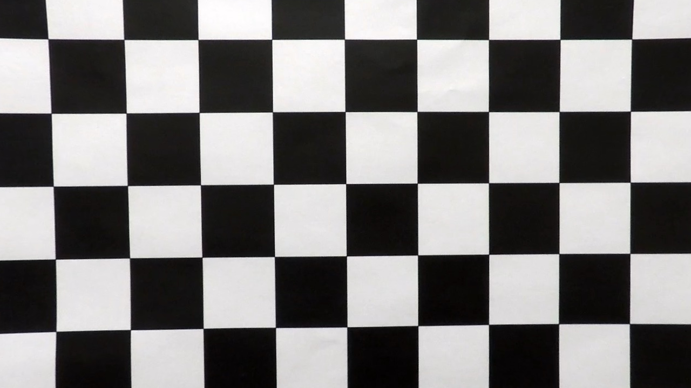

# Advanced Lane Detection

## Overview

The following steps were performed for lane detection:

* Compute the camera calibration matrix and distortion coefficients given a set of chessboard images.
* Apply a distortion correction to raw images.
* Use color transforms, gradients, etc., to create a thresholded binary image.
* Apply a perspective transform to rectify binary image ("birds-eye view").
* Detect lane pixels and fit to find the lane boundary.
* Determine the curvature of the lane and vehicle position with respect to center.
* Warp the detected lane boundaries back onto the original image.
* Output visual display of the lane boundaries and numerical estimation of lane curvature and vehicle position.

## Dependencies
* Python 3.7
* Numpy
* OpenCV-Python
* Matplotlib
* moviepy.editor
* IPython.display

## Camera calibration
The camera was calibrated using the chessboard images in 'camera_cal/*.jpg'. The following steps were performed for each calibration image:

* Convert to grayscale
* Find chessboard corners with OpenCV's `findChessboardCorners()` function, with a 9x6 board
* Used OpenCV's `calibrateCamera()` function to calculate the distortion matrices. Using the distortion matrices, I undistort images using OpenCV's `undistort()` function.

To illustrate, the following is the calibration image 'camera_cal/calibration1.jpg':

Here is the same image undistored via camera calibration:

The final calibration matrices are saved in the pickle file 'calibrate_camera.p'

## Lane detection pipeline
The following describes and illustrates the steps involved in the lane detection pipeline. For illustration, below is the original image we will use as an example:

### Undistort image
Using the camera calibration matrices in 'calibrate_camera.p', I undistort the input image. Below is the example image above, undistorted:

The code to perform camera calibration is in 'calibrate_camera.py'. For all images in 'test_images/\*.jpg', the undistorted version of that image is saved in 'output_images/undistort_\*.png'.

### Thresholded binary image
The next step is to create a thresholded binary image, taking the undistorted image as input. The goal is to identify pixels that are likely to be part of the lane lines. In particular, I perform the following:

### Perspective transform

### Polynomial fit

### Radius of curvature

### Vehicle offset from lane center

## Discussion
